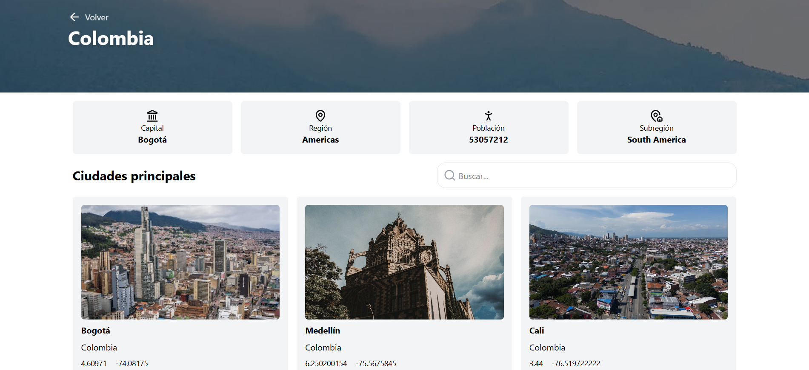

# 🌍 Countries Explorer

Aplicación web construida con **React + TypeScript + Vite** que permite explorar países, filtrarlos por región y descubrir lugares cercanos como restaurantes, hoteles y parques.

---

## ✨ Características

- 🔍 Búsqueda de países en tiempo real
- 🌎 Filtro por continentes
- 📍 Exploración de lugares cercanos (restaurantes, cafés, bares, etc.)
- ⚡ Navegación rápida con React Router
- 💅 UI moderna con TailwindCSS
- 🔄 Manejo de estado con URL params (query state)
- ⏳ Skeleton loaders para mejor UX

---

## 📸 Vista previa




---

## 🛠️ Tecnologías

- ⚛️ React
- 🟦 TypeScript
- ⚡ Vite
- 🎨 TailwindCSS
- 🔁 React Query
- 🧭 React Router

---

## 🚀 Instalación

```bash
# Clonar repositorio
git clone https://github.com/Lainercaceres11/places-country.git

# Entrar al proyecto
cd tu-repo

# Instalar dependencias
npm install

# Ejecutar en desarrollo
npm run dev
```

---

## 📂 Estructura del proyecto

```
src/
│
├── components/
├── hooks/
├── pages/
├── features/
├── request/
└── providers/
```

---

## 🧠 Hooks personalizados

El proyecto incluye hooks reutilizables como:

- `useQueryState` → sincroniza estado con la URL
- `useCountries` → obtiene países por región
- `usePlacesNearby` → obtiene lugares cercanos

---

## 🎯 Mejores prácticas implementadas

- Separación de lógica en hooks
- Componentes reutilizables
- Manejo de estados de carga
- Evita re-renders innecesarios
- Código tipado con TypeScript

---

## 📦 Build

```bash
npm run build
```

---

## 📄 Licencia

MIT

---

## 👨‍💻 Autor

Desarrollado por **Lainer Caceres**
